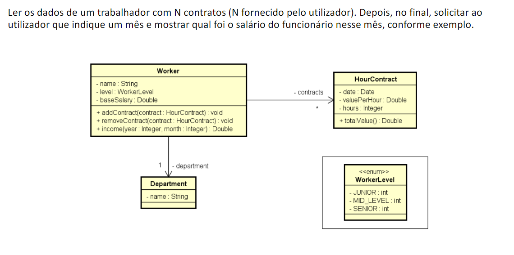

# Contracts-Management

Ler os dados de um trabalhador com N contratos (N fornecido pelo utilizador). Depois, no final, solicitar ao  utilizador que indique um mês e mostrar qual foi o salário do funcionário nesse mês, conforme exemplo.
